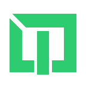

<p align="center">
<a href="http://tavernquest-v2.web.app/" target="_blank">
  
  
  
</a>
</p>

## About Tavern Quest

<!-- Tavern Quest 소개글 -->

[Tavern Quest](http://tavernquest-v2.web.app/) 는 파티를 등록하고 파티를 쉽게 찾을 수 있게 도와주는 ERP System 입니다. 급하게 구해야할 인원이 있다면 보상을 등록해보세요. 스케쥴을 관리를 보다 쉽게 해보세요.

## Front-End Structure

<p>
    
    
    
    
    
    
    
    
</p>

1. 현재 구성

- 현재 Laravel로 만든 API server 를 Backend로 하고 있음.
- Firesotre, Realtime Database 기반으로 변경가능
- State Management : RTK
- MUI 사용중이나 대부분 Material Design 기반으로 Custom Component 사용

2. 추후 변경할 내용

- Firebase RealtimeDB를 이용한 실시간 채팅기능 구현
- User Review System
- Party, Mecenary System

## Test User

```
ID: user@user.com
PASSWORD : password

ID: test@test.com
PASSWORD : password
```
